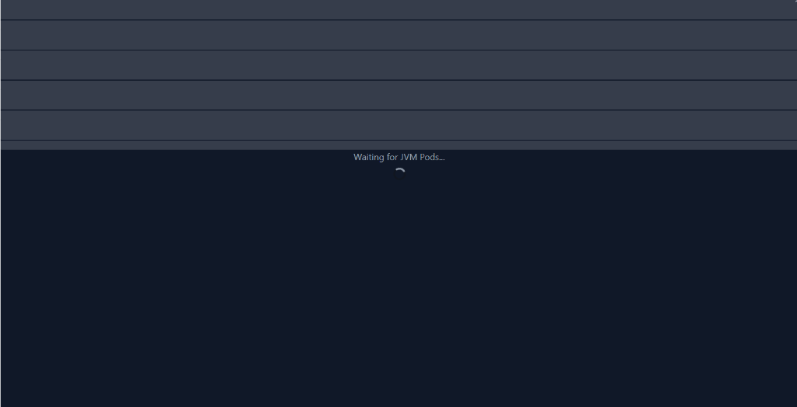
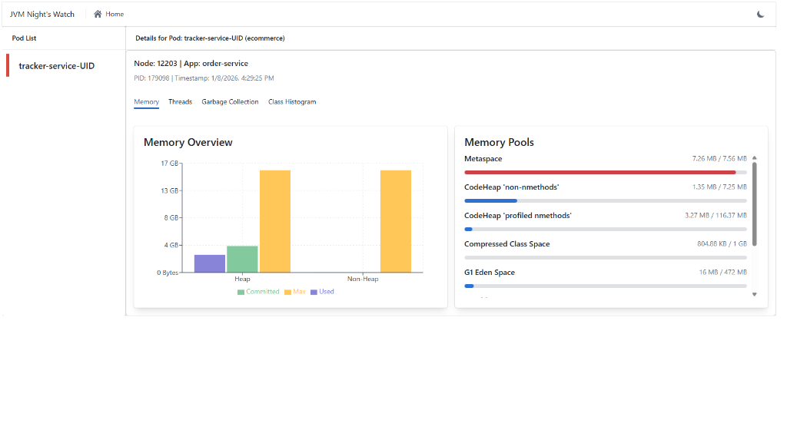
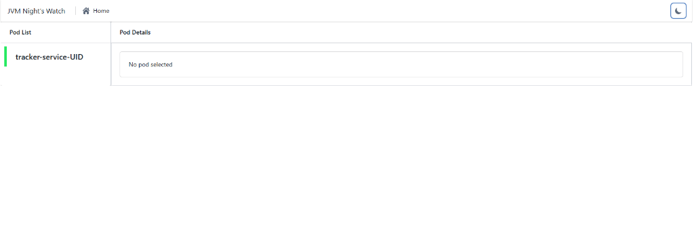

# JVM **A-Haytham** – Initial Phase Documentation


## Overview

JVM A-Haytham is a **lightweight, JVM monitoring tool** designed to observe **multiple running JVM processes** from a single host.

It is intentionally built **without Spring Boot or heavy frameworks** to remain:

* Low memory footprint
* Fast startup
* Container-friendly
* Suitable for **sidecar deployment** in orchestration platforms such as **OpenShift** or Kubernetes

The tool attaches to running JVMs, establishes JMX connections, and continuously collects runtime diagnostics such as:

* Thread states and deadlocks
* Heap and non-heap memory usage
* Metaspace consumption
* Garbage collection lifecycle
* Object/class histograms

At this phase, the focus is on **core JVM attachment, data collection, concurrency model, and lifecycle correctness**.
UI integration is currently in progress.

---

## Design Goals

* **Zero framework dependency** (native Java only)
* **Non-intrusive** monitoring of target JVMs
* **Multi-PID support**
* **Safe concurrency model**
* **Production-ready lifecycle behavior**
* **Sidecar-friendly architecture**

---

## High-Level Architecture

```
┌───────────────────────────────────────────────────────────────────────┐
│                     JVM Insight (Sidecar / Agent JVM)                 │
│                                                                       │
│  ┌──────────────┐                                                     │
│  │ PID Discovery│                                                     │
│  └──────┬───────┘                                                     │
│         │                                                             │
│         ▼                                                             │
│  ┌────────────────────┐                                               │
│  │ Collector Threads   │                                               │
│  │    (1 per PID)      │                                               │
│  └─────────┬───────────┘                                               │
│            │                                                           │
│            ▼                                                           │
│  ┌────────────────────┐                                               │
│  │ Snapshot Store      │                                               │
│  │  Immutable DTOs     │                                               │
│  └─────────┬───────────┘                                               │
│            │                                                           │
│    ┌───────┴────────┬─────────────────────┐                            │
│    ▼                ▼                     ▼                            │
│ ┌───────────┐ ┌──────────────┐ ┌───────────────────┐                  │
│ │ Delta     │ │ Rules Engine │ │ Insight Generator │                  │
│ │ Strategies│ │ Thresholds & │ │ Correlations &    │                  │
│ │ Snapshot  │ │ Conditions   │ │ Recommendations   │                  │
│ │ Diffing   │ │ Alerts        │ │ Root Cause Hints │                  │
│ └─────┬─────┘ └──────┬───────┘ └─────────┬─────────┘                  │
│       └──────────────┴───────────────────┘                            │
│                          │                                             │
│                          ▼                                             │
│              ┌──────────────────────────┐                              │
│              │ In-Memory View Model      │                              │
│              │ Metrics + Deltas + Alerts │                              │
│              │ Insights + Recommendations│                              │
│              └─────────────┬────────────┘                              │
│                            │                                            │
│                            ▼                                            │
│              ┌──────────────────────────┐                              │
│              │ HTTP Interface            │                              │
│              │ REST API / SSE            │                              │
│              └─────────────┬────────────┘                              │
│                            │                                            │
│                            ▼                                            │
│              ┌──────────────────────────┐                              │
│              │ React Dashboard           │                              │
│              │ Electron Desktop UI       │                              │
│              └──────────────────────────┘                              │
└───────────────────────────────────────────────────────────────────────┘
```

---

## JVM Attachment Model

### Virtual Machine Attach API

The tool uses the **JVM Attach API** to connect to running JVM processes by PID.

**Key characteristics of Attach:**

* It is a **short-lived, exclusive control channel**
* Used only to **bootstrap management capabilities**
* Not used for continuous monitoring

### Attach Lifecycle

For each target PID:

1. Attach to the JVM using `VirtualMachine.attach(pid)`
2. Load the **JVM management agent** if not already loaded
3. Retrieve the **local JMX connector address**
4. Establish a **JMX connection**
5. **Detach immediately** from the JVM

> **Important principle:**
> Attach is a *bootstrap mechanism*, not a monitoring session.

Once JMX is enabled, the attach channel is released to avoid conflicts and allow multiple JVMs to be monitored concurrently.

---

## JMX and TCP Communication

After the management agent is loaded:

* The target JVM starts a **local JMX server**
* Communication occurs over **RMI on loopback (127.0.0.1)**
* Under the hood, this uses **TCP sockets**
* No external ports are exposed

The monitoring tool communicates with the target JVM via a **JMX MBeanServerConnection**, which remains active independently of the Attach API.

---

## Management Beans and Data Collection

Once connected via JMX, the tool interacts with JVM **MXBeans** (management beans) using dynamic proxies.

### Collected Metrics

Each collector thread invokes MXBeans to gather:

* **ThreadMXBean**

  * Thread states
  * Stack traces
  * Deadlock detection

* **MemoryMXBean**

  * Heap usage
  * Non-heap usage

* **MemoryPoolMXBeans**

  * Eden / Survivor / Old Gen
  * Metaspace

* **GarbageCollectorMXBeans**

  * Collection count
  * Collection time

* **DiagnosticCommand MBean**

  * Class/object histogram
  * Instance counts
  * Memory footprint per class

These invocations occur entirely inside the **management thread context of the target JVM**, without code instrumentation or bytecode modification.

---

## Multithreaded Monitoring Model

### One Thread Per PID

The tool is explicitly designed to be **multi-PID and multi-threaded**:

* Each detected JVM PID gets **exactly one collector thread**
* Each collector thread:

  * Maintains its own JMX connection
  * Periodically samples metrics
  * Produces immutable snapshot DTOs

```
collector-1234  → JVM PID 1234
collector-5678  → JVM PID 5678
collector-9012  → JVM PID 9012
```

This model provides:

* Isolation between monitored JVMs
* No shared mutable JMX state
* Predictable performance

---

## Daemon Threads and JVM Lifecycle

### Why Collector Threads Are Daemon Threads

All collector threads are started as **daemon threads**:

* They perform background monitoring work
* They must not control JVM lifecycle
* They terminate automatically when the process shuts down

### JVM Liveness Strategy

The main thread blocks indefinitely (e.g. `join()` or latch) to:

* Keep the JVM alive
* Allow collectors to run continuously
* Support clean shutdown via OS signals (SIGTERM, SIGINT)

This design is **intentional and production-safe**, especially for containerized environments.

---

## Snapshot-Based Data Model

Collectors never expose live JMX objects.

Instead, they publish **immutable snapshot DTOs** into an in-memory store:

* Thread snapshots
* Heap snapshots
* GC snapshots
* Object histograms

The HTTP layer and UI **only read snapshots**.

This guarantees:

* No contention between collectors and UI
* No accidental JMX calls from HTTP threads
* Deterministic performance

---

## Intended Deployment Model (Sidecar Pattern)

The tool is designed to run as a **sidecar container** alongside application containers.

### Example Pod Layout

```
Pod
 ├── main-application-container (JVM)
 └── jvm-insight-sidecar (this tool)
```

### Sidecar Responsibilities

* Monitor all JVMs running inside the pod
* Expose diagnostics locally via HTTP
* No impact on application code
* No JVM restart required

This makes the tool suitable for:

* OpenShift
* Kubernetes
* Any container orchestration platform

---

## Why This Tool Is Lightweight

* Native Java only
* No Spring Boot
* No agents injected into application bytecode
* No persistent storage
* No external dependencies
* Minimal memory footprint

The tool is designed to be **always-on**, **low risk**, and **easy to ship**.

---

## Current Status

### Backend (Core)
✔ JVM discovery
✔ Attach & JMX bootstrap
✔ Multithreaded collectors
✔ Snapshot data model
✔ Correct JVM lifecycle handling

### Frontend (UI)
✔ **Modern Web Interface**: Built with React, Vite, and Electron.
✔ **Dark Mode Support**: Context-aware styling with persistent preferences.
✔ **Dashboards**:
  * **Memory**: Heap/Non-Heap visualization, Memory Pools breakdown.
  * **Threads**: State monitoring, Deadlock detection, Stack Traces.
  * **Garbage Collection**: G1/ZGC stats, pause times.
  * **Class Histogram**: Top memory-consuming classes.
✔ **Pod/Process Discovery**: Auto-detection of local JVMs.

## Gallery

### Dark Mode

*Dark theme loading screen*

### Light Mode

*Memory Dashboard in Light Mode*


*Pod Selection and Details*

---

## Future Roadmap (High-Level)

* UI dashboard (Threads, Heap, GC, Objects)
* Live updates (polling → SSE)
* PID lifecycle handling (JVM start/exit) 
* Snapshot diffing (done)
* Alerts (deadlocks, memory pressure) (done)

---

## Summary

**JVM Insight** is a purpose-built, low-overhead JVM monitoring sidecar that leverages:

* JVM Attach API (bootstrap only)
* JMX over local TCP
* MXBean proxies
* Safe multithreading
* Snapshot-driven architecture

Its goal is to provide **deep JVM observability** with **minimal operational cost**, making it ideal for modern containerized platforms.

